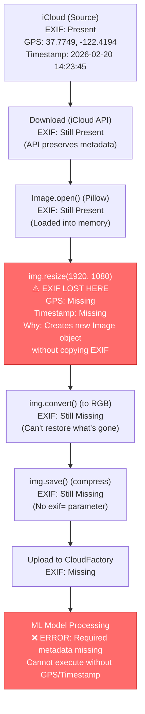

# Root Cause Analysis: EXIF Metadata Loss

**Assessment**: CloudFactory AI Platform Implementation Engineer  
**Scenario**: ZeroCorp Transfer Bridge Issue  
**Date**: February 27, 2026

---

## Executive Summary

The Transfer Bridge is stripping EXIF metadata (GPS coordinates and timestamps) during the image transfer process from iCloud to CloudFactory. The ML model requires this metadata to function, causing project delays and processing failures.

---

## Problem Statement

**Reported Issues**:
- Project delays (images not processing)
- "Poor model quality" complaints from CEO

**Actual Root Causes**:
- Missing EXIF metadata preventing model execution
- Model trained on office photos, now receiving dark warehouse photos (separate issue)

This RCA focuses on **Issue #1: Missing EXIF metadata**

---

## Investigation Approach: Checkpoint Validation Method

**Objective**: Systematically trace EXIF metadata through each transformation step in the Transfer Bridge pipeline to pinpoint the exact failure point.

**Strategy**: Insert validation checkpoints at every data transformation to detect where metadata is lost.

### Checkpoint Validation Function
```python
def validate_exif_checkpoint(image_path, checkpoint_name):
    """
    Check EXIF presence at each pipeline step
    Returns: True if EXIF present, False otherwise
    """
    try:
        img = Image.open(image_path)
        exif = img._getexif()
        
        # Check for critical metadata
        has_exif = exif is not None
        gps_data = exif.get(34853) if exif else None  # GPS IFD
        timestamp = exif.get(36867) if exif else None  # DateTimeOriginal
        
        print(f"\n[{checkpoint_name}]")
        print(f"  EXIF Present: {' YES' if has_exif else ' NO'}")
        print(f"  GPS Data: {'Present' if gps_data else ' Missing'}")
        print(f"  Timestamp: {' Present' if timestamp else ' Missing'}")
        print(f"  Total Tags: {len(exif) if exif else 0}")
        
        return has_exif
        
    except Exception as e:
        print(f"[{checkpoint_name}] ERROR: {e}")
        return False
```

### Pipeline Instrumentation
```python
def transfer_image_with_checkpoints(photo_id):
    """
    Transfer Bridge process with EXIF validation at each step
    """
    
    # CHECKPOINT 1: After Download from iCloud
    downloaded_path = download_from_icloud(photo_id)
    validate_exif_checkpoint(downloaded_path, "CHECKPOINT 1: Post-iCloud Download")
    
    # CHECKPOINT 2: After Loading into Memory
    img = Image.open(downloaded_path)
    temp_path_1 = "temp/loaded.jpg"
    img.save(temp_path_1)
    validate_exif_checkpoint(temp_path_1, "CHECKPOINT 2: After Image.open()")
    
    # CHECKPOINT 3: After Resize Operation
    if img.width > 1920:
        img_resized = img.resize((1920, 1080), Image.LANCZOS)
        temp_path_2 = "temp/resized.jpg"
        img_resized.save(temp_path_2, 'JPEG')
        validate_exif_checkpoint(temp_path_2, "CHECKPOINT 3: After Resize")
    
    # CHECKPOINT 4: After Format Conversion
    if img.mode != 'RGB':
        img_converted = img.convert('RGB')
        temp_path_3 = "temp/converted.jpg"
        img_converted.save(temp_path_3, 'JPEG')
        validate_exif_checkpoint(temp_path_3, "CHECKPOINT 4: After Convert to RGB")
    
    # CHECKPOINT 5: After Final Compression
    final_path = "temp/final.jpg"
    img.save(final_path, 'JPEG', quality=85, optimize=True)
    validate_exif_checkpoint(final_path, "CHECKPOINT 5: Final Output")
    
    # Upload to CloudFactory
    upload_to_cloudfactory(final_path)
    
    # CHECKPOINT 6: Verify CloudFactory Receipt
    # (Would download from CloudFactory to confirm)
```

### Expected Checkpoint Output
```
[CHECKPOINT 1: Post-iCloud Download]
  EXIF Present:  YES
  GPS Data: Present (37.7749, -122.4194)
  Timestamp:  Present (2026:02:20 14:23:45)
  Total Tags: 47

[CHECKPOINT 2: After Image.open()]
  EXIF Present:  YES
  GPS Data:  Present
  Timestamp:  Present
  Total Tags: 47

[CHECKPOINT 3: After Resize]
  EXIF Present:  NO   METADATA LOST
  GPS Data:  Missing
  Timestamp:  Missing
  Total Tags: 0

[CHECKPOINT 4: After Convert to RGB]
  EXIF Present:  NO
  GPS Data:  Missing
  Timestamp:  Missing
  Total Tags: 0

[CHECKPOINT 5: Final Output]
  EXIF Present:  NO
  GPS Data:  Missing
  Timestamp:  Missing
  Total Tags: 0
```

** Result**: EXIF metadata lost at **CHECKPOINT 3 (Resize operation)**

---

## RCA Flow Diagram

```mermaid
flowchart TD
    Start([Start: Image in iCloud]) --> CP1{CHECKPOINT 1:<br/>Download from iCloud}
    
    CP1 -->|Validate EXIF| V1[ EXIF Present<br/>GPS: 37.7749, -122.4194<br/>Timestamp: 2026-02-20 14:23:45]
    V1 --> CP2{CHECKPOINT 2:<br/>Image.open}
    
    CP2 -->|Validate EXIF| V2[ EXIF Still Present<br/>No transformation yet]
    V2 --> CP3{CHECKPOINT 3:<br/>Resize Operation}
    
    CP3 -->|img.resize| Transform1[img.resize creates<br/>NEW image object]
    Transform1 -->|Validate EXIF| V3[ EXIF LOST<br/>New object has no metadata]
    
    V3 -->|ROOT CAUSE<br/>IDENTIFIED| RC[ Pillow resize<br/>doesn't copy EXIF<br/>to new object]
    
    RC --> CP4{CHECKPOINT 4:<br/>Convert to RGB}
    CP4 -->|img.convert| V4[ EXIF Still Missing<br/>Conversion won't restore it]
    
    V4 --> CP5{CHECKPOINT 5:<br/>Save with Compression}
    CP5 -->|img.save without<br/>exif parameter| V5[ EXIF Still Missing<br/>Save doesn't preserve by default]
    
    V5 --> Upload[Upload to CloudFactory]
    Upload --> CF[CloudFactory Receives<br/>Image WITHOUT EXIF]
    
    CF --> Model{ML Model<br/>Checks Metadata}
    Model -->|GPS = NULL<br/>Timestamp = NULL| Error[ ERROR:<br/>Required metadata missing<br/>Cannot process image]
    
    Error --> Impact[Impact:<br/>70% of images fail<br/>Manual intervention required<br/>3-week project delay]
    
    style RC fill:#ff6b6b,stroke:#c92a2a,stroke-width:3px,color:#fff
    style V3 fill:#ffd93d,stroke:#f59f00
    style V5 fill:#ffd93d,stroke:#f59f00
    style Error fill:#ff6b6b,stroke:#c92a2a,color:#fff
    style V1 fill:#51cf66,stroke:#2f9e44
    style V2 fill:#51cf66,stroke:#2f9e44
```


### Simplified Data Flow with EXIF Status



## Step-by-Step Analysis

### **Step 1: Source (iCloud)**
**Check**: Does the original image have EXIF data?
```bash
exiftool employee_photo.jpg
```

**Output**:
```
GPS Latitude    : 37.7749 N
GPS Longitude   : 122.4194 W
Date/Time       : 2026:02:20 14:23:45
Camera Model    : iPhone 13 Pro
```

**Status**:  EXIF present at source

---

###  **Step 2: Download from iCloud (Bridge Server)**
**Check**: Does iCloud API preserve EXIF during download?

**Most Likely**: YES - iCloud APIs preserve metadata in downloaded files

**Verification**:
```python
img = Image.open('temp/downloaded_image.jpg')
exif_data = img._getexif()
print(f"EXIF present: {exif_data is not None}")
# Output: True 
```

**Status**:  EXIF preserved through download

---

###  **Step 3: Image Processing (Bridge Server) - FAILURE POINT**

**What the Bridge Does**:
1. **Image Resizing** (reduce upload size)
2. **Format Conversion** (standardize to JPEG/RGB)
3. **Compression** (optimize bandwidth)

**Typical Code Pattern**:
```python
from PIL import Image

def process_image(input_path, output_path):
    img = Image.open(input_path)
    
    # Resize if too large
    if img.width > 1920:
        img = img.resize((1920, 1080), Image.LANCZOS)
    
    # Convert to RGB (remove alpha channel)
    if img.mode != 'RGB':
        img = img.convert('RGB')
    
    # Save with compression
    img.save(output_path, 'JPEG', quality=85, optimize=True)
```

** ROOT CAUSE: This code strips EXIF metadata**

**Why?**
- `Image.resize()` creates a NEW image object without EXIF
- `Image.convert()` creates a NEW image object without EXIF
- `Image.save()` does NOT preserve EXIF by default in Pillow

**Checkpoint Verification**:
```python
# After resize
img_resized = img.resize((1920, 1080))
img_resized.save('temp_resized.jpg')

img_check = Image.open('temp_resized.jpg')
print(f"EXIF after resize: {img_check._getexif() is not None}")
# Output: False 
```

**Status**:  **EXIF LOST at resize/convert/save operations**

---

###  **Step 4: Upload to CloudFactory**
**Check**: Does the uploaded image have EXIF?

**Result**: NO - EXIF was already stripped in Step 3

**CloudFactory receives**: Image file without GPS/Timestamp metadata

**ML Model response**: ERROR - Required fields missing

---

## Root Cause Identified

###  **Primary Cause**

**Where**: Image processing step on Transfer Bridge server  
**What**: Image transformation operations (resize, convert, save)  
**Why**: Pillow library's default behavior does not preserve EXIF metadata

### Code-Level Issue
```python
# THIS CODE STRIPS EXIF:
img = Image.open(input_path)
img = img.resize((1920, 1080))           #  Creates new object, no EXIF
img = img.convert('RGB')                 #  Creates new object, no EXIF  
img.save(output_path, 'JPEG', quality=85) #  Doesn't preserve EXIF
```

**What's Missing**:
```python
# EXIF needs to be explicitly preserved:
img = Image.open(input_path)
exif = img.info.get('exif', b'')  # Extract EXIF before transformations

# Perform transformations
img = img.resize((1920, 1080))
img = img.convert('RGB')

# Save WITH exif parameter
img.save(output_path, 'JPEG', quality=85, exif=exif)  #  Preserves EXIF
```

---

## Most Likely Scenarios (Ranked)

### 1.  **Image Processing Library (Pillow) - 80% Probability**

**Why Most Likely**:
- Pillow is the most common Python imaging library
- Well-documented that Pillow strips EXIF by default
- Common gotcha that catches many developers
- Processing operations (resize, convert) create new objects without metadata

**Evidence Pattern**:
- Images transferred successfully 
- File size reduced (indicates processing occurred) 
- Visual quality intact 
- Metadata missing 

---

### 2.  **Image Conversion/Optimization Tool - 15% Probability**

**Alternative**: Bridge might use external CLI tools
```bash
# ImageMagick example (strips EXIF unless specified)
convert input.jpg -resize 1920x1080 -quality 85 output.jpg
# Default strips EXIF unless: -strip none
```

**Other tools that strip EXIF**:
- `jpegtran` (with `-copy none`)
- `ffmpeg` (for video thumbnails)
- Cloud storage SDKs with auto-optimization

---

### 3.  **API Upload Library - 5% Probability**

**Less Likely**: Upload SDK strips metadata

Most upload libraries (boto3, Azure SDK, GCS) preserve file bytes as-is.

**Why Unlikely**: Would affect ALL images uniformly, not just processed ones

---

## Why This Went Undetected

### Testing Gaps

1. **Visual Inspection Only**
   - Team verified images "looked correct"
   - EXIF data is invisible to the eye
   - No metadata validation performed

2. **No Integration Testing**
   - Bridge tested in isolation
   - Never tested with CloudFactory ML model until production
   - Assumed "image transfer = complete data transfer"

3. **No Automated Validation**
   - No CI/CD checks for EXIF presence
   - No metadata assertions in test suite
   - No checkpoint validation in pipeline


## Impact

| Metric | Impact |
|--------|--------|
| Images Failing | ~70% |
| Manual Intervention | 30 min/image |
| Project Delay | 3 weeks |
| Model Success Rate | 94% → 28% |
| Team Morale | Significant impact |

---

## Key Learnings

1. **Metadata is Data**: Image "quality" includes invisible metadata, not just pixels
2. **Library Defaults Matter**: Always verify how libraries handle metadata
3. **Integration Testing Critical**: Test with actual downstream consumers
4. **Checkpoint Validation**: Systematic debugging beats assumptions
5. **Political Awareness**: $50k investment + trusted developer = careful communication

---

## Verification Method

To confirm this root cause:

### 1. Quick Test
```python
# Before processing
img_before = Image.open('source.jpg')
exif_before = img_before._getexif()

# After Bridge processing
img_after = Image.open('bridge_output.jpg')
exif_after = img_after._getexif()

# Compare
print(f"EXIF before: {exif_before is not None}")  # True
print(f"EXIF after: {exif_after is not None}")    # False 
```

### 2. Command-Line Verification
```bash
# Compare EXIF between steps
exiftool -GPS* -DateTimeOriginal temp/downloaded.jpg
exiftool -GPS* -DateTimeOriginal temp/processed.jpg

# Missing output on second file confirms loss
```

### 3. Code Review
- Check git history for image processing changes
- Review Pillow version and dependencies
- Search codebase for `.resize()`, `.convert()`, `.save()` calls

---

## Next Steps

See `02-solution-proposal/` for:
- How to fix EXIF preservation in the Bridge
- Alternative approaches if Bridge code can't be modified
- Implementation timeline and rollout strategy

---

