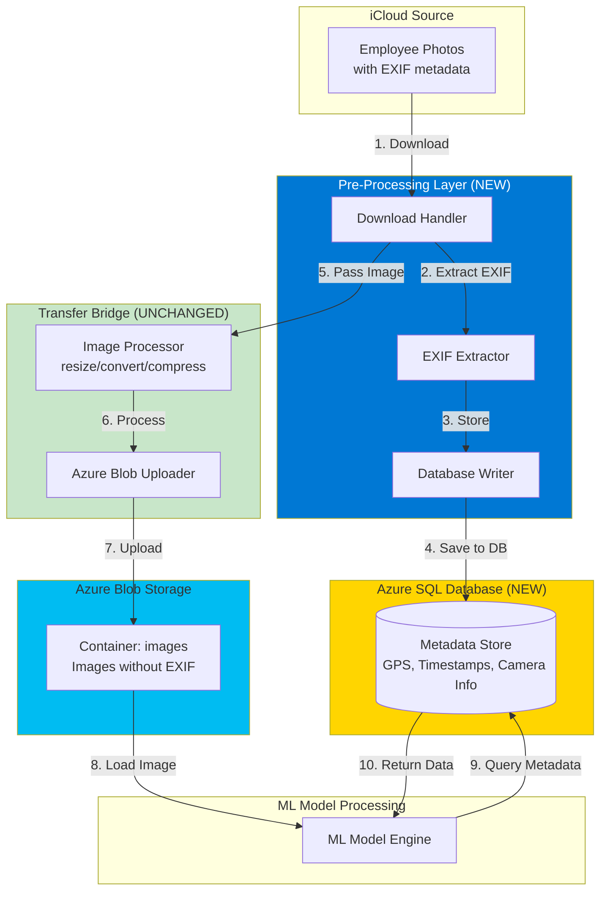
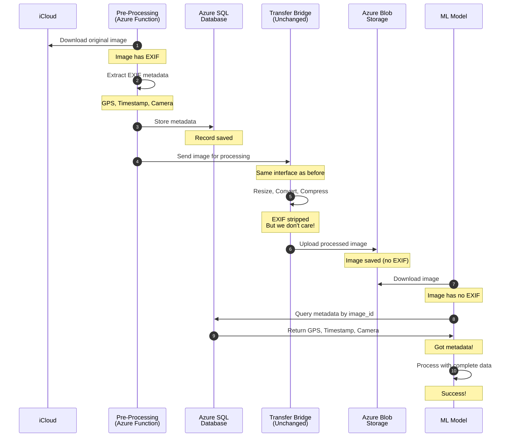
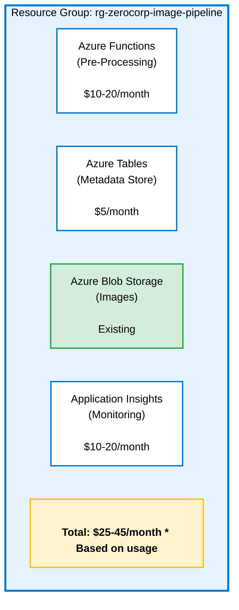
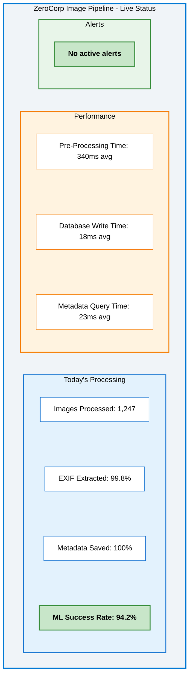

# Solution Architecture: EXIF Metadata Preservation (Azure)

**Problem**: Transfer Bridge strips EXIF metadata (GPS/Timestamps) during image processing  
**Solution**: Pre-Processing Metadata Store on Azure  
**Date**: February 27, 2026

---

## Architecture Overview

Extract and store EXIF metadata in Azure SQL Database **BEFORE** the Transfer Bridge processes images. This preserves the Bridge code unchanged while ensuring metadata is available for the ML model.

**Key Principle**: Save the metadata first, then let the Bridge do what it does.

---

## High-Level Architecture


---

## System Components

| Component | What It Does | Status |
|-----------|-------------|--------|
| **iCloud Source** | Original photos with EXIF | Existing |
| **Pre-Processing Layer** | Downloads, extracts EXIF, stores in database | **NEW** |
| **Azure Table** | Stores metadata (GPS, timestamps, camera info) | **NEW** |
| **Transfer Bridge** | Resizes, compresses, uploads images | **UNCHANGED** |
| **Azure Blob Storage** | Stores processed images | Existing |
| **ML Model** | Processes images using metadata from database | Updated (queries DB) |

---

## Data Flow: Step-by-Step

### Visual Flow

```mermaid
flowchart TD
    A["STEP 1: Original Photo in iCloud<br/><br/>employee_001.jpg<br/>GPS: 37.7749, -122.4194<br/>Timestamp: 2026-02-20 14:23:45<br/>Camera: iPhone 13 Pro"]
    
    B["STEP 2: Pre-Processing Downloads & Extracts<br/><br/>Azure Function runs:<br/>1. Downloads image from iCloud<br/>2. Opens image file<br/>3. Reads EXIF metadata<br/>4. Extracts key fields:<br/>   - GPS coordinates<br/>   - Timestamp<br/>   - Camera information"]
    
    C["STEP 3: Store in Azure SQL Database<br/><br/>Record created:<br/>image_id: employee_001.jpg<br/>gps_latitude: 37.7749<br/>gps_longitude: -122.4194<br/>timestamp_original: 2026-02-20 14:23:45<br/>camera_make: Apple<br/>camera_model: iPhone 13 Pro<br/>status: OK<br/><br/> Metadata safely stored"]
    
    D["STEP 4: Pass to Transfer Bridge<br/><br/>Pre-Processing hands image file to Bridge<br/>- Bridge receives exactly what it expects<br/>- No changes to Bridge interface<br/>- Bridge doesn't know about pre-processing"]
    
    E["STEP 5: Bridge Processes Image (UNCHANGED)<br/><br/>Bridge does its normal work:<br/>- Resizes image to 1920x1080<br/>- Converts to RGB<br/>- Compresses to reduce file size<br/>-  EXIF gets stripped during this process<br/><br/>But we don't care! We already saved it in Step 3!"]
    
    F["STEP 6: Upload to Azure Blob Storage<br/><br/>Bridge uploads processed image:<br/>- Container: images<br/>- File: employee_001.jpg<br/>- No EXIF metadata in the file<br/>- Upload completes successfully"]
    
    G["STEP 7: ML Model Needs to Process<br/><br/>ML model workflow:<br/>1. Downloads image from Azure Blob Storage<br/>2. Sees that image has no EXIF<br/>3. Queries Azure SQL Database for metadata"]
    
    H["STEP 8: Database Query<br/><br/>Query: Get metadata for employee_001.jpg<br/><br/>Database returns:<br/>GPS: 37.7749, -122.4194<br/>Timestamp: 2026-02-20 14:23:45<br/>Camera: iPhone 13 Pro<br/><br/>Query time: ~20ms (fast!)"]
    
    I["STEP 9: ML Model Processes Successfully<br/><br/>ML model now has:<br/> Image data (from Blob Storage)<br/> GPS coordinates (from Database)<br/> Timestamp (from Database)<br/><br/>Result: Processing succeeds!<br/>No more NULL errors!"]
    
    A --> B
    B --> C
    C --> D
    D --> E
    E --> F
    F --> G
    G --> H
    H --> I
    
    style C fill:#90ee90,stroke:#2d862d,color:#000
    style E fill:#ffd700,stroke:#b8860b,color:#000
    style I fill:#90ee90,stroke:#2d862d,color:#000
```


---

## Sequence Diagram


## Key Design Decisions

### 1. Why Extract BEFORE Bridge?

**Problem**: Bridge strips EXIF during processing

**Solution**: Save EXIF before Bridge touches the image

**Analogy**: Like making a copy of important documents before sending originals through a shredder

### 2. Why Use Database Instead of Files?

| Approach | Database | JSON Files |
|----------|----------|------------|
| **Lookup Speed** | Very fast (indexed) | Slow (file system search) |
| **Queryable** | Yes (SQL queries) | No (must parse each file) |
| **Scalable** | Millions of records | Gets messy at scale |
| **Consistency** | Built-in (transactions) | Manual file management |
| **Cost** | $5-25/month | $0 but operational overhead |

**Decision**: Database is better for production systems

### 3. Why Azure Managed Identity?

**Old way** (passwords in code):
```
 Database password in configuration file
 Risk of password leaks
 Manual password rotation
```

**New way** (Managed Identity):
```
 Azure handles authentication automatically
 No passwords in code
 Automatic credential rotation
 More secure
```

---

## Azure Services Used


---

## Error Handling

### What Happens If Things Fail?

| Failure Scenario | System Response |
|-----------------|-----------------|
| **Image download fails** | Retry 3 times, then alert |
| **No EXIF in image** | Store record with status "EXIF_MISSING", continue processing |
| **Database write fails** | Retry, don't forward to Bridge until saved |
| **Bridge fails** | Retry, metadata already safely stored |
| **Database unavailable** | ML model shows clear error, operations team alerted |

**Key Principle**: Fail gracefully, never lose data, always log what happened

---

## Monitoring Dashboard

## Success Metrics


- [ ] Every image has metadata in database
- [ ] Database queries complete in < 50ms
- [ ] ML model success rate back to 94%
- [ ] Zero "NULL metadata" errors
- [ ] System runs 24/7 without issues
- [ ] Bridge operates exactly as before
- [ ] Complete audit trail available

---

## Why This Solution Works

- Transfer Bridge code completely unchanged
- $50k investment fully preserved
- Solves metadata loss problem
- Scalable to millions of images
- Fast queries (milliseconds)
- Industry-standard architecture
- Fixes project delays
- Restores ML model accuracy
- Low monthly cost ($25-45)
- Quick implementation (4 weeks)

---

**Related Documents**:
- See `Solutions_Options.md` for options comparison
- See `01-root-cause-analysis/RCA.md` for problem diagnosis
