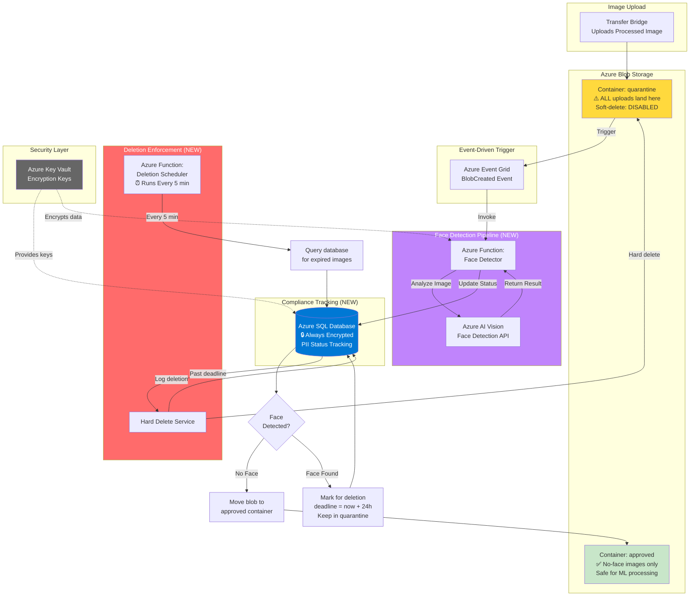
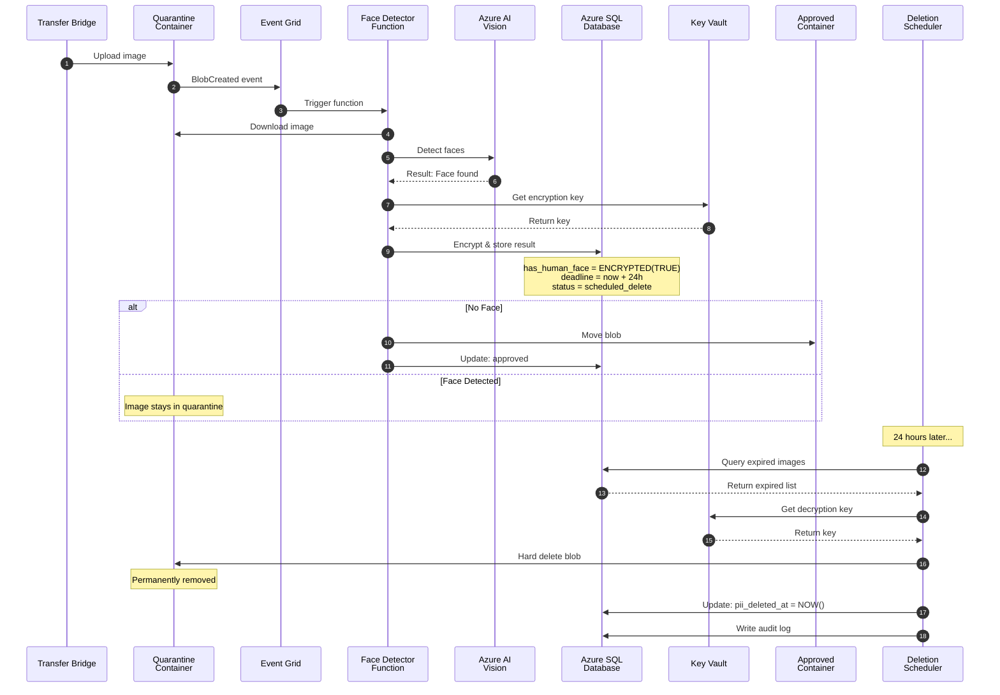

# Solution Architecture: 24-Hour PII Deletion (Azure)

**Problem**: Images with human faces must be hard deleted within 24 hours (Compliance Requirement)  
**Solution**: Automated Face Detection & Deletion Pipeline with Encrypted Tracking  
**Cloud Platform**: Microsoft Azure  
**Date**: February 27, 2026

---

## Architecture Overview

Implement an automated compliance system that detects faces in uploaded images, tracks them in an encrypted database, and guarantees hard deletion within 24 hours using Azure-native services.

**Design Principle**: Quarantine all uploads first, verify face presence, then route to approved storage or schedule for deletion.

---

## High-Level Architecture


---

## System Components

| Component | Purpose | Type | Status |
|-----------|---------|------|--------|
| **Quarantine Container** | Temporary staging for all uploads | Blob Storage | **NEW** |
| **Approved Container** | Storage for verified no-face images | Blob Storage | **NEW** |
| **Azure Event Grid** | Triggers face detection on upload | Event Service | **NEW** |
| **Face Detector Function** | Analyzes images using AI Vision | Azure Function | **NEW** |
| **Azure AI Vision** | Face detection service (API) | Cognitive Service | **NEW** |
| **Compliance Database** | Encrypted tracking store | Azure SQL | **NEW** |
| **Azure Key Vault** | Manages encryption keys | Security Service | **NEW** |
| **Deletion Scheduler** | Enforces 24h deletion policy | Azure Function | **NEW** |
| **Application Insights** | Monitoring, logging, audit trail | Monitoring Service | **NEW** |

---

## Data Flow: Step-by-Step

### Upload to Detection
```
┌────────────────────────────────────────────────────┐
│ STEP 1: Image Upload                               │
│                                                    │
│ Transfer Bridge uploads processed image            │
│ ├─ Destination: quarantine container ⚠️           │
│ ├─ NOT production/approved                        │
│ └─ Status: Awaiting face detection                │
└──────────────────┬─────────────────────────────────┘
                   │
                   ▼
┌────────────────────────────────────────────────────┐
│ STEP 2: Event Grid Triggers                        │
│                                                    │
│ Azure Event Grid detects new blob                  │
│ ├─ Event Type: "BlobCreated"                      │
│ ├─ Container: "quarantine"                        │
│ └─ Action: Trigger Face Detector Function         │
│                                                    │
│ Latency: ~100-200ms                                │
└──────────────────┬─────────────────────────────────┘
                   │
                   ▼
┌────────────────────────────────────────────────────┐
│ STEP 3: Face Detection                             │
│                                                    │
│ Face Detector Function:                            │
│ 1. Downloads image from quarantine                 │
│ 2. Calls Azure AI Vision API                       │
│ 3. Receives detection result:                      │
│    ├─ Faces found: YES/NO                         │
│    ├─ Face count: 0, 1, 2, ...                    │
│    └─ Confidence score: 0.0 - 1.0                 │
│                                                    │
│ Processing time: ~200-500ms                        │
└──────────────────┬─────────────────────────────────┘
                   │
                   ▼
┌────────────────────────────────────────────────────┐
│ STEP 4: Database Update (Encrypted)                │
│                                                    │
│ Store detection result in Azure SQL Database       │
│                                                    │
│ Fields updated:                                    │
│ ├─ has_human_face: TRUE/FALSE (🔒 encrypted)      │
│ ├─ face_count: 1                                  │
│ ├─ face_detection_timestamp: NOW()                │
│ ├─ pii_delete_required: TRUE (if face found)      │
│ └─ pii_delete_deadline: NOW() + 24 hours          │
│                                                    │
│ Encryption: Azure Key Vault + Always Encrypted    │
└──────────────────┬─────────────────────────────────┘
                   │
                   ▼
┌────────────────────────────────────────────────────┐
│ STEP 5: Routing Decision                           │
│                                                    │
│ IF NO FACE DETECTED:                               │
│ ├─ Move blob: quarantine → approved container     │
│ ├─ Update database: status = "approved"           │
│ └─ Image available for ML processing ✅           │
│                                                    │
│ IF FACE DETECTED:                                  │
│ ├─ Keep in quarantine container                   │
│ ├─ Status: "scheduled_delete"                     │
│ ├─ Deadline: 24 hours from detection              │
│ └─ DO NOT move to approved ⚠️                     │
└────────────────────────────────────────────────────┘
```

---

### Deletion Workflow (24 Hours Later)
```
┌────────────────────────────────────────────────────┐
│ STEP 6: Deletion Scheduler Runs                    │
│                                                    │
│ Timer Trigger: Every 5 minutes                     │
│                                                    │
│ Actions:                                           │
│ 1. Query database for expired images               │
│    WHERE pii_delete_deadline < NOW()               │
│      AND pii_deleted_at IS NULL                    │
│                                                    │
│ 2. For each expired image:                         │
│    ├─ Retrieve blob location                       │
│    ├─ Verify deadline passed                       │
│    └─ Proceed to hard delete                       │
└──────────────────┬─────────────────────────────────┘
                   │
                   ▼
┌────────────────────────────────────────────────────┐
│ STEP 7: Hard Delete from Storage                   │
│                                                    │
│ Delete blob from quarantine container              │
│                                                    │
│ Hard delete requirements:                          │
│ ├─ Bypass soft-delete (no recovery)               │
│ ├─ Delete all versions (if versioning on)         │
│ ├─ Delete all snapshots                           │
│ └─ Permanent removal (irrecoverable) ✅           │
│                                                    │
│ Deletion time: ~100-200ms per blob                 │
└──────────────────┬─────────────────────────────────┘
                   │
                   ▼
┌────────────────────────────────────────────────────┐
│ STEP 8: Update Database & Audit Log                │
│                                                    │
│ Mark image as deleted:                             │
│ ├─ pii_deleted_at = NOW()                         │
│ ├─ processing_status = "deleted"                  │
│ └─ deletion_verified = TRUE                       │
│                                                    │
│ Create audit log entry:                           │
│ ├─ Deletion timestamp                             │
│ ├─ Time from upload to deletion                   │
│ ├─ Compliance status: COMPLIANT ✅                │
│ └─ Audit trail ID for regulators                  │
└────────────────────────────────────────────────────┘
```

---

## Sequence Diagram


---

## Database Schema Design

### Compliance Tracking Table
```
TABLE: image_metadata

┌─────────────────────────────────────────────────────┐
│ EXIF Metadata (from previous solution)              │
├─────────────────────────────────────────────────────┤
│ • image_id (Primary Key)                            │
│ • gps_latitude, gps_longitude                       │
│ • timestamp_original                                │
│ • camera_make, camera_model                         │
├─────────────────────────────────────────────────────┤
│ PII Compliance Fields (NEW)                         │
├─────────────────────────────────────────────────────┤
│ • has_human_face (ENCRYPTED 🔒)                     │
│ • face_count                                        │
│ • face_detection_confidence (0.0 - 1.0)            │
│ • face_detection_timestamp                          │
│                                                     │
│ • pii_delete_required (TRUE/FALSE)                  │
│ • pii_delete_deadline (timestamp + 24h)            │
│ • pii_deleted_at (when actually deleted)           │
│ • deletion_verified (TRUE/FALSE)                    │
├─────────────────────────────────────────────────────┤
│ Processing Status                                   │
├─────────────────────────────────────────────────────┤
│ • processing_status:                                │
│   - 'uploaded' (just uploaded)                      │
│   - 'face_detection_pending' (analyzing)            │
│   - 'no_face_approved' (moved to approved)          │
│   - 'scheduled_delete' (awaiting deletion)          │
│   - 'deleted' (permanently removed)                 │
├─────────────────────────────────────────────────────┤
│ Blob Location Tracking                              │
├─────────────────────────────────────────────────────┤
│ • blob_container ('quarantine' or 'approved')       │
│ • blob_url (full path to blob)                      │
├─────────────────────────────────────────────────────┤
│ Audit Trail                                         │
├─────────────────────────────────────────────────────┤
│ • created_at (upload timestamp)                     │
│ • updated_at (last modification)                    │
└─────────────────────────────────────────────────────┘
```

### Database Indexes (for Performance)
```
Performance Indexes:
├─ PRIMARY KEY on image_id (fast lookups)
├─ INDEX on pii_delete_deadline (deletion queries)
├─ INDEX on processing_status (status filtering)
└─ INDEX on blob_container (routing queries)
```

---

## Encryption Strategy: Always Encrypted

### What is Always Encrypted?
```
┌─────────────────────────────────────────────────┐
│ Regular Database Encryption                     │
├─────────────────────────────────────────────────┤
│ ├─ Data encrypted on disk                      │
│ ├─ Data DECRYPTED in database memory           │
│ ├─ DBAs can see decrypted data                 │
│ └─ Risk: Memory dumps, admin access            │
└─────────────────────────────────────────────────┘

┌─────────────────────────────────────────────────┐
│ Always Encrypted (Our Choice) 🔒               │
├─────────────────────────────────────────────────┤
│ ├─ Data encrypted on disk AND in memory        │
│ ├─ Database NEVER sees decrypted data          │
│ ├─ Only authorized apps can decrypt            │
│ ├─ DBAs see only encrypted bytes               │
│ └─ Keys stored in Azure Key Vault              │
└─────────────────────────────────────────────────┘
```

### Encryption Setup
```
Step 1: Create Column Master Key
├─ Stored in: Azure Key Vault
├─ Key Type: RSA 2048-bit
└─ Access: Managed Identity only

Step 2: Create Column Encryption Key
├─ Encrypted by: Column Master Key
├─ Algorithm: RSA_OAEP
└─ Rotation: Automatic every 90 days

Step 3: Encrypt Sensitive Column
├─ Column: has_human_face
├─ Encryption Type: Deterministic (allows WHERE queries)
├─ Algorithm: AEAD_AES_256_CBC_HMAC_SHA_256
└─ Result: DBAs cannot see if image has face
```

### Who Can See What?

| Role | EXIF Data | Face Status (Encrypted) | Face Status (Decrypted) |
|------|-----------|------------------------|------------------------|
| **Database Admin** | ✅ Yes | ✅ Yes (encrypted bytes only) | ❌ No |
| **Azure Function** (with key) | ✅ Yes | ✅ Yes | ✅ Yes (auto-decrypts) |
| **ML Model** | ✅ Yes | ❌ Not needed | ❌ Not needed |
| **Operations Team** | ✅ Yes (dashboard) | ❌ No | ❌ No |
| **Attacker** (if DB breached) | ⚠️ Exposed | ✅ Encrypted (useless) | ❌ No (needs Key Vault) |

---

## Critical Configuration: Storage Containers

### Quarantine Container
```
Container Name: quarantine
Purpose: Temporary staging for ALL uploads

Configuration:
├─ Access Level: Private (no public access)
├─ Soft Delete: DISABLED ❌ (Critical!)
├─ Versioning: DISABLED ❌ (Critical!)
├─ Change Feed: Enabled (audit trail)
└─ Lifecycle Policy: Delete blobs > 48 hours (failsafe)

Why disable soft-delete?
└─ Soft-delete allows recovery for 7-14 days
   This violates 24-hour hard delete requirement
   Must be IRRECOVERABLY deleted for compliance ✅
```

### Approved Container
```
Container Name: approved
Purpose: Storage for verified no-face images

Configuration:
├─ Access Level: Private
├─ Soft Delete: Enabled (7 days) ✅ (OK - no PII)
├─ Versioning: Optional
└─ Lifecycle Policy: Archive after 90 days (cost optimization)
```

---

## Compliance Guarantees

### 24-Hour Deletion Timeline
```
Timeline Breakdown:

Upload Time:           T + 0:00
├─ Image uploaded to quarantine
│
Face Detection:        T + 0:00 to T + 0:01
├─ Event Grid triggers (100-200ms)
├─ Face detection runs (200-500ms)
└─ Database updated with deadline

Deletion Deadline:     T + 24:00
├─ 24 hours from detection timestamp
│
Deletion Scheduler:    Runs every 5 minutes
├─ Checks at: T+24:00, T+24:05, T+24:10...
│
Maximum Deletion Time: T + 24:10
├─ 24 hours (deadline)
├─ + 5 minutes (scheduler interval)
├─ + ~1 minute (processing time)
└─ Total: 24 hours 6 minutes ✅

Failsafe Mechanism:    T + 48:00
└─ Lifecycle policy deletes anything > 48 hours
   Catches any missed deletions
```

### Hard Delete Verification
```
Hard Delete Checklist:

✅ Blob deleted from quarantine container
✅ Soft-delete bypassed (no recovery possible)
✅ All versions purged (if versioning was on)
✅ All snapshots deleted
✅ Database updated: pii_deleted_at = NOW()
✅ Audit log created with timestamp
✅ No way to recover the image

Verification Method:
└─ Attempt to restore deleted blob
   Result: Error "Blob not found" ✅
```

---

## Monitoring & Audit Trail

### Alert Configuration
```
Critical Alerts (Immediate Action):
├─ Image past 24h deadline not deleted
├─ Deletion scheduler failed
├─ Key Vault unavailable
└─ Action: Page on-call team

Warning Alerts (Email Team):
├─ Face detection failure rate > 10%
├─ Quarantine container > 100 images for > 12h
└─ Database query latency > 100ms
```

---

## Why This Solution Works

- **Compliance**: enforced hard deletion within the required window
- **Security**: Always Encrypted + Key Vault + managed identities
- **Reliability**: event-driven + scheduler + failsafe lifecycle policy
- **Minimal disruption**: Bridge remains unchanged except upload destination

---

## Implementation Timeline (4 Weeks)

- **Week 1:** Storage + DB + Key Vault + Event Grid
- **Week 2:** Face detection function + Vision integration + encryption verification
- **Week 3:** Deletion scheduler + hard delete validation + alerts
- **Week 4:** Production rollout + monitoring + documentation

---

## Success Criteria

- Zero images with faces remain stored beyond 24 hours
- Hard-delete is irrecoverable (no soft delete/versioning escape hatches)
- Complete, queryable audit trail exists for regulators
- 99.9% system uptime with monitoring and alerting active

---

**This architecture guarantees compliance with the 24-hour PII deletion requirement using Azure-native services and industry best practices.**
