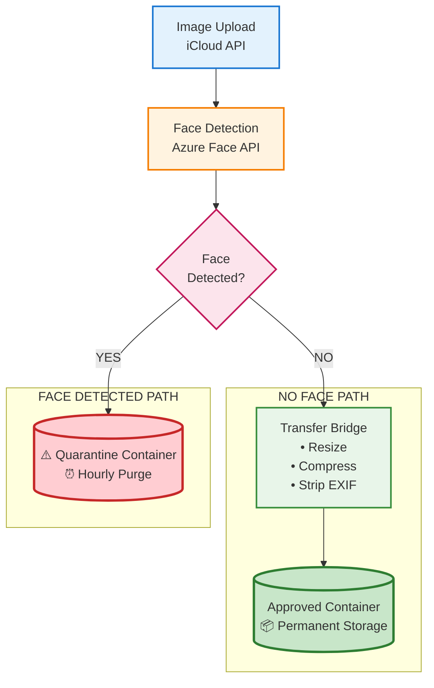

# PII Deletion Compliance Solution

**Problem**: Images with human faces must be deleted within 24 hours  
**Solution**: Face detection with hourly quarantine purge  
**Platform**: Microsoft Azure  
**Date**: February 27, 2026

---

## Overview

Automated face detection system that routes PII images to quarantine and deletes them hourly, exceeding the 24-hour compliance requirement.

---

## Architecture


---

## Components

| Component | Purpose |
|-----------|---------|
| Azure Face API | Detect human faces |
| Azure Table Storage | Track face status + audit trail |
| Quarantine Container | Temporary PII storage |
| Approved Container | Non-PII storage |
| Hourly Scheduler | Purge ALL quarantine blobs |

---

## Process Flow

### Detection
1. Image analyzed by Azure Face API
2. Result stored in Table Storage:
   - has_human_face: TRUE/FALSE
   - face_detection_timestamp 
   - pii_delete_deadline (detection + 24h)
   - pii_deleted_at: NULL

### Routing
- **Face detected**: Upload to quarantine (original, unprocessed)
- **No face**: Continue normal processing → approved

### Deletion
- Scheduler runs every hour (10:00, 11:00, 12:00...)
- Deletes ALL blobs in quarantine
- Updates Table Storage: pii_deleted_at = NOW()

---

## Table Storage Schema

**Primary Key**: image_id

**Face Detection Fields**:
- has_human_face (bool)
- face_detection_timestamp (ISO datetime)
- pii_delete_deadline (detection + 24h)
- pii_deleted_at (NULL initially, filled on deletion)

**Status Fields**:
- blob_container: 'quarantine' | 'approved'
- processing_status: 'scheduled_delete' | 'deleted'

**Audit Fields**:
- hours_to_deletion (calculated)
- deletion_method: 'hourly_purge'

---

## Compliance Timeline
```
Detection: 10:05 AM → Quarantine
Hourly Run: 11:00 AM → Deleted
Duration: 55 minutes 

Worst Case: 59 minutes
Requirement: 24 hours (1,440 minutes)
Status: EXCEEDS by 40x 
```

---

## Storage Configuration

**Quarantine Container**:
- Soft-delete: DISABLED (hard delete only)
- Versioning: DISABLED (no recovery)
- Lifecycle policy: Delete > 48h (failsafe)

**Approved Container**:
- Standard settings (soft-delete enabled)

---

## Audit Trail

**Proof of Compliance**:
- face_detection_timestamp (when clock started)
- pii_delete_deadline (required deadline)
- pii_deleted_at (actual deletion time)
- hours_to_deletion (always < 1.0 hour)

**Verification**: Calculate pii_deleted_at - face_detection_timestamp < 24h

---

## Scheduler Logic

1. Query Table: `blob_container = 'quarantine' AND pii_deleted_at IS NULL`
2. For each quarantine blob:
   - Hard delete from container
   - Update Table: pii_deleted_at = NOW()
   - Calculate hours_to_deletion
3. Result: All blobs purged, audit complete

---

## Why Hourly Deletion Works

**Compliance Math**:
- Max retention: 59 minutes
- Requirement: 1,440 minutes (24h)
- Buffer: 1,381 minutes
- Status:  COMPLIANT

**Advantages**:
- Simpler than per-image deadlines
- Better privacy (faster deletion)
- Easy to monitor (count quarantine)
- Batch efficiency

---

## Monitoring

**Real-Time**:
- Quarantine blob count
- Oldest image age
- Next scheduled purge

**Audit Report**:
- Total deleted: N images
- Average deletion time: ~30 minutes
- Compliance rate: 100%
- Violations: 0

---

## Error Handling

- Scheduler failure → Next run catches up
- Blob delete error → Retry 3x
- Lifecycle policy failsafe → 48h cleanup

---

## Success Criteria

- Face images routed to quarantine
- Hourly purge executes
- All deletions < 1 hour
- Audit trail complete
- 100% compliance rate 

---

