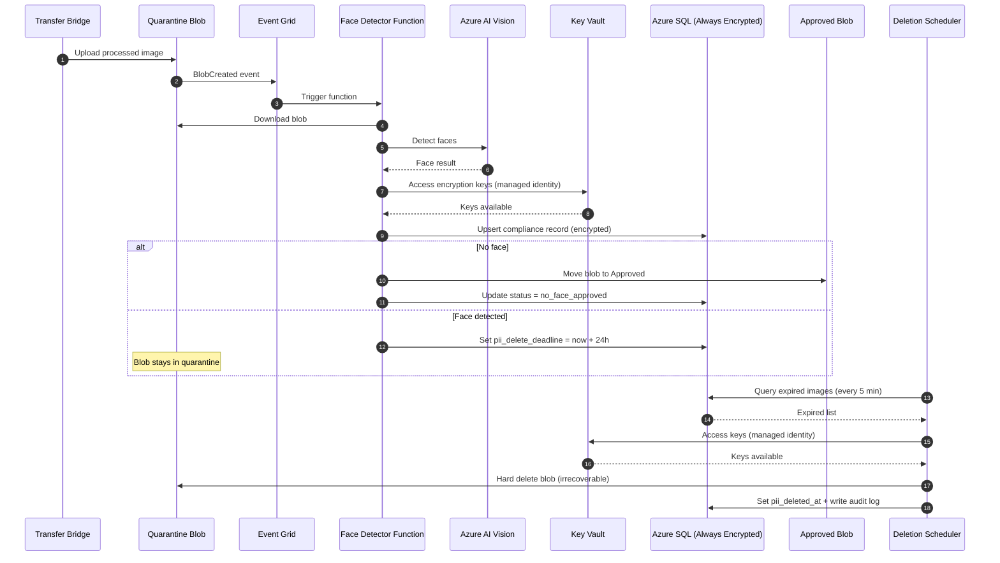
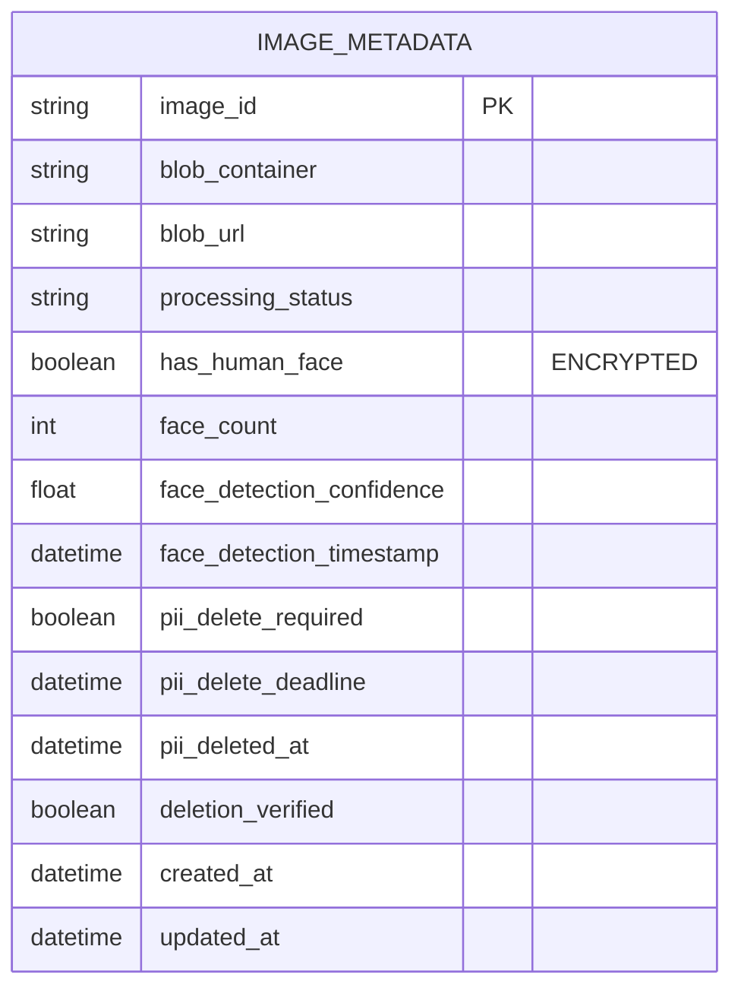

# Solution Architecture: 24-Hour PII Deletion (Azure)

**Problem**: Images with human faces must be hard deleted within 24 hours (Compliance Requirement)  
**Solution**: Automated Face Detection & Deletion Pipeline with Encrypted Tracking  
**Cloud Platform**: Microsoft Azure  
**Date**: February 27, 2026

---

## Architecture Overview

Implement an automated compliance system that detects faces in uploaded images, tracks them in an encrypted database, and guarantees hard deletion within 24 hours using Azure-native services.

**Design Principle**: Quarantine all uploads first, verify face presence, then route to approved storage or schedule for deletion.

---

## High-Level Architecture (Mermaid)

```mermaid
flowchart TB
    A[Transfer Bridge<br/>(UNCHANGED)] -->|Uploads| B[Azure Blob Storage<br/>Quarantine Container<br/>⚠️ Soft delete OFF]
    B -->|BlobCreated Event| C[Azure Event Grid]
    C -->|Invoke| D[Azure Function<br/>Face Detector]
    D -->|Analyze| E[Azure AI Vision<br/>Face Detection API]
    E -->|Result| D
    D -->|Upsert status (encrypted)| F[(Azure SQL Database<br/>Always Encrypted)]
    F --> G{Face<br/>Detected?}

    G -->|No| H[Move blob to Approved<br/>Container ✅]
    H --> I[Approved Container<br/>Safe for ML]

    G -->|Yes| J[Keep in Quarantine ⚠️<br/>Set delete deadline = now + 24h]
    J --> F

    K[Azure Function<br/>Deletion Scheduler<br/>Runs every 5 min] -->|Query expired| F
    F -->|Expired items| K
    K -->|Hard delete| B
    K -->|Write audit + pii_deleted_at| F

    L[Azure Key Vault] -.->|Keys for encryption| F
    L[Azure Key Vault] -.->|Managed identity access| D
    L[Azure Key Vault] -.->|Managed identity access| K
```

---

## System Components

| Component | Purpose | Type | Status |
|-----------|---------|------|--------|
| **Quarantine Container** | Temporary staging for all uploads | Blob Storage | **NEW** |
| **Approved Container** | Storage for verified no-face images | Blob Storage | **NEW** |
| **Azure Event Grid** | Triggers face detection on upload | Event Service | **NEW** |
| **Face Detector Function** | Analyzes images using AI Vision | Azure Function | **NEW** |
| **Azure AI Vision** | Face detection service (API) | Cognitive Service | **NEW** |
| **Compliance Database** | Encrypted tracking store | Azure SQL | **NEW** |
| **Azure Key Vault** | Manages encryption keys | Security Service | **NEW** |
| **Deletion Scheduler** | Enforces 24h deletion policy | Azure Function | **NEW** |
| **Application Insights** | Monitoring, logging, audit trail | Monitoring Service | **NEW** |

---

## End-to-End Flow (Step-by-Step)

### 1) Upload → Quarantine
- Bridge uploads all processed images to **quarantine**
- Soft delete and versioning must be **disabled** to support irreversible deletion

### 2) Event Trigger
- Blob creation triggers **Event Grid**
- Event Grid invokes **Face Detector Function**

### 3) Face Detection
- Function downloads blob and calls **Azure AI Vision**
- Result returned: face/no-face, count, confidence

### 4) Compliance Record (Encrypted)
- Function upserts compliance fields into **Azure SQL** using **Always Encrypted**
- Stores `pii_delete_deadline = face_detection_timestamp + 24h` when face found

### 5) Routing
- If **no face**: blob moved to **approved**
- If **face**: blob stays in **quarantine**, scheduled for deletion

### 6) Enforcement
- Deletion Scheduler runs every 5 minutes:
  - queries for expired (`pii_delete_deadline < now` and not deleted)
  - hard deletes from quarantine
  - writes audit trail + `pii_deleted_at`

---

## Sequence Diagram (Mermaid)



---

## Database Model (Mermaid ERD)



---

## Critical Storage Configuration

### Quarantine Container (Compliance Critical)
- **Soft delete: DISABLED**
- **Versioning: DISABLED**
- Private access only
- Lifecycle failsafe: delete blobs older than 48 hours

### Approved Container
- May enable soft delete (no PII)
- Standard lifecycle management for cost optimization

---

## Encryption Strategy

**Azure SQL Always Encrypted** ensures the database never sees plaintext values for sensitive columns (e.g., `has_human_face`).

- Column Master Key in **Azure Key Vault**
- Access via **Managed Identity**
- Use **Deterministic encryption** for queryable equality checks

---

## Compliance Guarantee

Deletion deadline is computed at detection time:

- `pii_delete_deadline = face_detection_timestamp + 24 hours`

Enforcement loop:

- Scheduler runs every 5 minutes → worst-case deletion ~24h + 5–10 min  
- Lifecycle failsafe at 48h provides backup guardrail

---

## Monitoring & Alerts

### Must-have alerts
- Any image past deadline not deleted
- Scheduler not running / failing
- Key Vault unavailable
- Face detection error rate above threshold

### Key metrics
- `faces_detected_rate`
- `time_to_delete_p95`
- `quarantine_backlog`
- `db_write_latency_ms`
- `db_query_latency_ms`

---

## Implementation Timeline (4 Weeks)

- **Week 1:** Storage containers, Azure SQL Always Encrypted, Key Vault, Event Grid
- **Week 2:** Face Detector Function + AI Vision integration + encryption verification
- **Week 3:** Deletion Scheduler + hard delete validation + alerts + dashboard
- **Week 4:** Production rollout + canary + monitoring + documentation

---

## Success Criteria

- Zero images with faces remain beyond 24 hours
- Hard delete is irrecoverable (no soft delete/versioning escape paths)
- End-to-end audit trail is queryable and exportable
- Monitoring and alerts active with on-call escalation

---

**This architecture enforces the 24-hour PII deletion requirement using Azure-native services and mermaid-based diagrams suitable for design reviews and compliance audits.**
