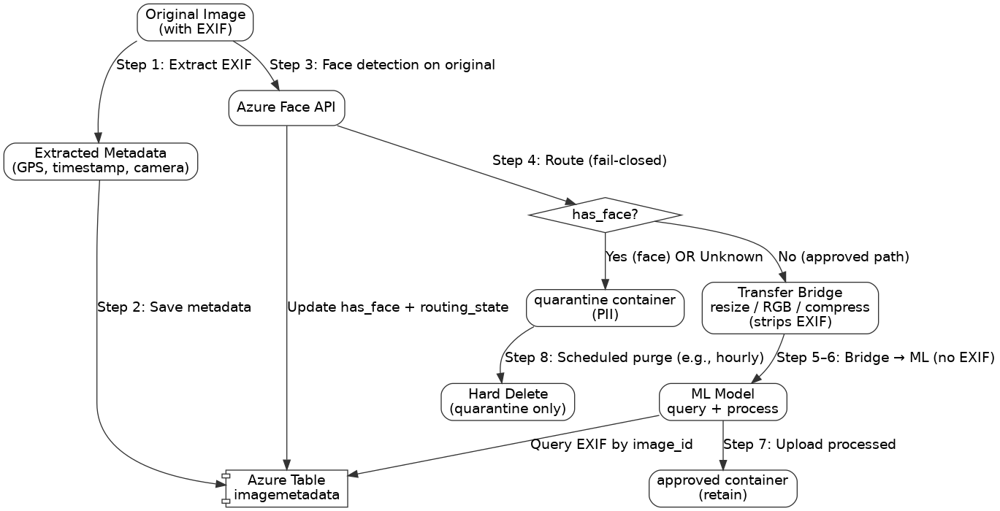

# ZeroCorp Solution — EXIF Preservation + PII (Face) 24‑Hour Deletion
_Last updated: 2026-02-28_

## 1) Summary
Transfer Bridge transformations (resize/convert/compress) strip EXIF metadata. This solution preserves EXIF by extracting it **before** the bridge and storing it in **Azure Table Storage**, while enforcing privacy by routing any image with a detected (or unknown) human face to a **quarantine** container that is **hard-deleted within 24 hours**.

## 2) Goals and Non‑Goals

### Goals
- Preserve EXIF-derived fields (GPS, timestamp, camera info) for downstream ML even when EXIF is stripped in the image pipeline.
- Guarantee that any image containing a human face (PII) is **hard deleted within 24 hours**.
- Keep the design operable: retry-safe, observable, and easy to troubleshoot during early customer activation.

### Non‑Goals
- Changing or re-architecting Transfer Bridge internals.
- Performing facial recognition/identity; only face presence detection is required.

## 3) Architecture

### Rendered Flow Diagram (embedded)


### Mermaid Source (for easy editing)
```mermaid
flowchart TD
    A[Original Image<br/>(with EXIF)] -->|Step 1: Extract EXIF| B[Extracted Metadata<br/>(GPS, timestamp, camera)]
    B -->|Step 2: Save metadata| T[(Azure Table<br/>imagemetadata)]

    A -->|Step 3: Face detection on original| F[Azure Face API]
    F -->|Update has_face + routing_state| T
    F --> D{Step 4: has_face?}

    D -->|Yes (face) or Unknown| Q[quarantine container<br/>(PII)]
    D -->|No (approved path only)| BR[Step 5: Transfer Bridge<br/>resize / RGB / compress<br/>(strips EXIF)]

    BR -->|Step 6: ML receives image bytes<br/>(no EXIF)| M[ML Model<br/>query + process]
    M -->|Query EXIF by image_id| T
    M -->|Step 7: Upload processed image| AP[approved container<br/>(retain)]

    Q -->|Step 8: Scheduled purge (e.g., hourly)<br/>Delete ALL quarantine blobs| HD[Hard Delete<br/>(quarantine only)]
```

## 4) Step-by-Step (mapped to code modules)

| Step | Module / Function | Action | Output |
|------|-------------------|--------|--------|
| 1 | `modules/step1_extract_exif.extract_exif()` | Extract EXIF (GPS, timestamp, camera) from original image | `metadata_dict`, `PIL.Image` |
| 2 | `modules/step2_save_to_table.save_metadata()` | Upsert EXIF metadata to Azure Table (`imagemetadata`) | Table entity created/updated |
| 3 | `face_detection.detect_and_update()` | Run Face API on original; write `has_human_face` + timestamps | Table entity updated |
| 4 | `modules/blob_router.route_to_container()` | **Fail-closed routing**: True/None → quarantine; False → continue | Blob stored + table pointers updated |
| 5 | `modules/step3_transfer_bridge.simulate_transfer_bridge()` | Transform image for ML (EXIF removed) | processed image bytes |
| 6 | `modules/step4_ml_model.ml_model_process()` | ML receives bytes; queries Table for EXIF by `image_id`; processes | inference output + metadata |
| 7 | `modules/blob_router.route_to_container()` | Upload no-face result to approved container | Approved blob URI saved |
| 8 | Scheduled job (cron/Function) | Purge quarantine blobs; set `pii_deleted_at` | Compliance satisfied |

## 5) Data Model (Azure Table: `imagemetadata`)

### Keys
- **PartitionKey**: recommended `YYYYMMDD` (date bucket) or tenant/customer (avoid hot partitions).
- **RowKey**: recommended UUID or content hash (avoid filename collisions).

### Core fields (suggested minimum)
- **EXIF**: `gps_latitude`, `gps_longitude`, `timestamp_original`
- **Face / compliance**: `has_human_face` (True/False/None), `face_detection_timestamp`, `pii_delete_deadline`, `pii_deleted_at`
- **Workflow**: `routing_state` (quarantine | eligible | approved), `status`, `status_updated_at`, `schema_version`
- **Blob pointers**: `original_blob_uri`, `quarantine_blob_uri`, `approved_blob_uri`

## 6) Processing States & Idempotency

### State machine (recommended)
- `exif_extracted → exif_saved → face_scanned → routed`
- If `has_human_face in (True, None)`: `quarantined_written → pii_deleted`
- If `has_human_face == False`: `bridge_processed → ml_processed → approved_written`

### Idempotency rules
- Use stable IDs (UUID/hash) and **upsert** table entities.
- Only write blob URI fields after the blob write succeeds.
- Status transitions only move forward (safe retries).

## 7) Failure Handling (must be safe)

### Face API failure / timeout
- Set `has_human_face = None`
- Route to **quarantine** (fail-closed; never approve unknown)

### Table write failure
- Stop the pipeline; do not proceed to bridge/ML.
- Retry using idempotent upsert.

### Blob upload failure
- Do not advance status; retry upload.
- Ensure table pointer updates happen after successful blob write.

## 8) Compliance Controls (24‑hour PII deletion)
- All face/unknown images are isolated to **quarantine**.
- Scheduled purge job runs frequently (e.g., hourly) and hard-deletes all quarantine blobs.
- Optional defense-in-depth: add a storage lifecycle delete policy as a backstop.

## 9) Observability (recommended)
**Metrics**
- Face API success/error rate + latency
- Routing counts: quarantine vs eligible/approved
- Quarantine SLA: *oldest quarantine blob age*
- Purge job deleted count + failures

**Alerts**
- Any quarantine blob older than 23 hours
- Purge job failures
- Sudden spikes in `has_human_face = None`

## 10) Runbook (first 90 days)

### Issue: “EXIF missing downstream”
**Checks**
1. Table row exists for `image_id` and contains `timestamp_original` / GPS fields.
2. ML logs confirm a successful table lookup by `image_id`.

**Fix**
- Re-run Step 1–2 to backfill table metadata for the affected image IDs.
- Confirm ML uses table values (not embedded EXIF) for features.

### Issue: “Quarantine not purging / PII SLA risk”
**Checks**
1. Purge job last successful run time; any failures.
2. Oldest quarantine blob age (must be < 24h).
3. Table `pii_delete_deadline` vs current time.

**Fix**
- Trigger purge job manually and remediate permissions/RBAC if deletes fail.
- Add lifecycle delete policy as a backstop if not present.

### Issue: “Face API errors → throughput issues”
**Expected behavior**
- Increased routing to quarantine due to `None` results (safe/fail-closed).

**Fix**
- Implement retry/backoff, confirm credentials/endpoint, monitor rate limits.
- If needed, throttle ingestion while preserving fail-closed routing.
