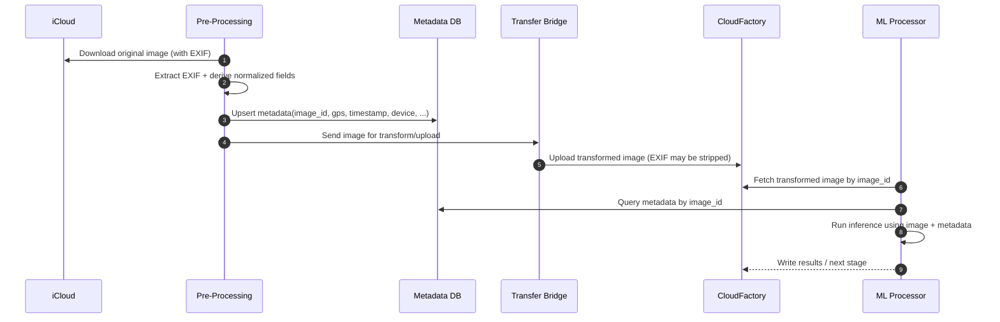
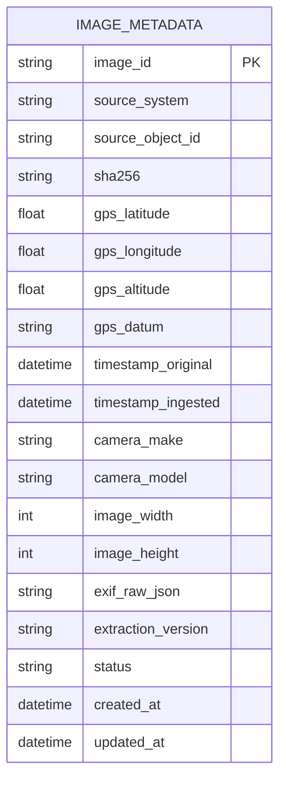

# Solution Architecture: Option 2 — Pre‑Processing Metadata Store (Recommended)

**Date:** 2026-02-27  
**Goal:** Preserve EXIF metadata (GPS/timestamps/etc.) required by the ML model **without modifying** the Transfer Bridge.

---

## 1. Architecture Overview

### High-level idea
Before the Transfer Bridge transforms images (and strips EXIF), we extract EXIF from the **original** image and persist it as **structured data** in a centralized store. Downstream systems (ML model, reporting, compliance) query the metadata store using a stable `image_id`.

---

## 2. System Components

| Component | Responsibility | Notes |
|---|---|---|
| **iCloud Source** | Original image source of truth | Provides original EXIF-bearing images |
| **Pre‑Processing Service** *(NEW)* | Downloads image, extracts EXIF, writes metadata record, forwards image to Bridge | Stateless; horizontally scalable |
| **Metadata Store (DB)** *(NEW)* | Central source of truth for image metadata | Indexed on `image_id` |
| **Transfer Bridge** *(UNCHANGED)* | Resizes/compresses/uploads image to CloudFactory | May strip EXIF; no longer a problem |
| **CloudFactory Storage/Queue** | Stores transformed images and/or pipeline events | Existing |
| **ML Inference/Processor** | Retrieves metadata from DB and runs inference | Uses `image_id` to join image + metadata |
| **(Optional) Face Detection Service** | Detect faces and annotate metadata record | Supports PII lifecycle workflows |
| **(Optional) Deletion Scheduler** | Enforces deletion policies | Out of scope for EXIF-only; included for extensibility |

---

## 3. End-to-End Data Flow

### 3.1 Primary flow (EXIF preservation)
```mermaid
flowchart LR
  A[iCloud: Original Image] --> B[Pre-Processing Service]
  B -->|Extract EXIF| C[(Metadata Store)]
  B -->|Forward original file| D[Transfer Bridge (unchanged)]
  D --> E[CloudFactory Storage]
  E --> F[ML Processor]
  F -->|Lookup by image_id| C
  F --> G[ML Output]
```

### 3.2 What changes vs. today
- **New:** EXIF extraction + persistence occurs **before** Bridge transforms the image.
- **Unchanged:** Bridge continues doing what it does today (resize/compress/upload).

---

## 4. Sequence Diagram



---

## 5. Identifiers & Join Strategy

### 5.1 `image_id` definition (recommendation)
Use a deterministic ID that is stable across stages. Choose one:

- **Preferred:** `image_id = SHA256(original_bytes)` (content-addressable)
- **Alternative:** `image_id = icloud_photo_id` (if stable and unique)
- **Hybrid:** `image_id = icloud_photo_id` plus store `sha256` for integrity

### 5.2 Why this matters
The ML processor must reliably join:
- **Transformed image** (in CloudFactory)
- **Metadata record** (in DB)

---

## 6. Metadata Schema (Industry Standard)

### 6.1 Core table (conceptual)



### 6.2 Recommended indexes
- `PRIMARY KEY(image_id)`
- `INDEX(timestamp_original)`
- `INDEX(source_system, source_object_id)` (if using source IDs)
- `INDEX(sha256)` (if using content hash validation)

---

## 7. Pre‑Processing Service Design

### 7.1 Responsibilities
1. Download original image
2. Extract EXIF
3. Normalize key fields (GPS, timestamps)
4. Persist metadata
5. Forward image to Bridge
6. Emit metrics and logs for observability

### 7.2 Error handling policy (recommended)
| Failure | Behavior | Rationale |
|---|---|---|
| Image download fails | Retry w/ backoff; send to DLQ after N attempts | Protects throughput |
| EXIF extraction fails | Write metadata record w/ `status=EXIF_MISSING`; continue | Avoids blocking pipeline |
| DB write fails | Retry; if still failing, halt forwarding to Bridge | Prevents images without metadata |
| Bridge forwarding fails | Retry; do not duplicate DB record (idempotent upsert) | Ensures correctness |

### 7.3 Idempotency
Make `upsert(image_id)` idempotent so retries do not create duplicates.

---

## 8. Security & Compliance (Baseline)

### 8.1 Data classification
- EXIF GPS + timestamps can be sensitive.
- Store least-privilege access and audit logs.

### 8.2 Access control
- Pre‑Processing Service: write access to metadata table
- ML Processor: read access (scoped to required columns)
- Admin/Analytics: read with audit

### 8.3 Encryption
- In transit: TLS
- At rest: DB encryption (cloud-managed)

---

## 9. Observability & Monitoring

### 9.1 Metrics (must-have)
- `exif_extraction_success_rate`
- `metadata_db_write_latency_ms`
- `metadata_lookup_latency_ms`
- `pipeline_throughput_images_per_min`
- `missing_exif_rate` (source quality)
- `retry_count` and `dlq_depth`

### 9.2 Logs & tracing
- Correlate logs by `image_id`
- Distributed tracing across Pre‑Processing → Bridge → CloudFactory → ML

---

## 10. Performance Considerations

### 10.1 Latency budget
- Pre‑Processing EXIF extraction: typically milliseconds to low tens of ms
- DB upsert: target p95 < 50ms
- ML lookup: target p95 < 50ms

### 10.2 Throughput scaling
- Pre‑Processing is stateless → scale horizontally
- DB: scale via read replicas (for ML lookups) and proper indexing

---

## 11. Failure Modes & Mitigations

| Risk | Impact | Mitigation |
|---|---|---|
| DB unavailable | ML cannot obtain metadata | Multi-AZ/HA + retries; degrade gracefully with clear errors |
| Partial pipeline writes | Image processed without metadata | Gate forwarding to Bridge on successful metadata upsert |
| EXIF missing at source | Data gaps | Record `status=EXIF_MISSING`; alert on threshold |
| Duplicate events | Duplicate processing | Idempotent `image_id` + upsert; dedupe in queues |
| Schema evolution | Breaking changes | Versioned extraction (`extraction_version`); additive schema changes |

---

## 12. Implementation Plan (Suggested)

### Week 1
- DB provision + schema + indexes
- Pre‑Processing skeleton service
- EXIF extraction library + unit tests

### Week 2
- Integrate Pre‑Processing before Bridge
- End-to-end tests (small batch)
- Observability: metrics + logging + dashboards

### Week 3
- Load tests + resilience tests
- DLQ + retry policies tuned
- ML integration: metadata lookup + fallbacks

### Week 4
- Production rollout (canary)
- Validation of success criteria
- Post-deploy monitoring and hardening

---

## 13. Success Criteria

- **100%** of ingested images have a metadata record (even if `EXIF_MISSING`)
- **p95 metadata lookup latency < 50ms**
- ML pipeline restores target success rate (e.g., **≥ 94%**)
- Zero “NULL GPS/timestamp” failures attributable to metadata loss

---

## Appendix A: Minimal Field Mapping

| EXIF Tag | Field | Notes |
|---|---|---|
| GPSLatitude / GPSLongitude | `gps_latitude`, `gps_longitude` | Normalize to decimal degrees |
| GPSAltitude | `gps_altitude` | Optional |
| DateTimeOriginal | `timestamp_original` | Prefer over DateTime if present |
| Make / Model | `camera_make`, `camera_model` | Optional but useful |
| PixelXDimension / PixelYDimension | `image_width`, `image_height` | Or derived from image |

---

## Appendix B: Example Pre‑Processing Pseudocode

```python
def preprocess(icloud_id: str) -> str:
    # 1) Download original
    path = download_from_icloud(icloud_id)

    # 2) Compute stable ID (choose approach)
    image_id = sha256_file(path)

    # 3) Extract + normalize EXIF
    exif = extract_exif(path)
    normalized = normalize_exif(exif)

    # 4) Upsert metadata (idempotent)
    db.upsert_image_metadata(
        image_id=image_id,
        source_system="icloud",
        source_object_id=icloud_id,
        sha256=image_id,
        **normalized,
        status="OK" if normalized.get("timestamp_original") else "EXIF_MISSING",
        extraction_version="v1"
    )

    # 5) Forward to Bridge (unchanged)
    bridge.enqueue(image_path=path, image_id=image_id)

    return image_id
```
