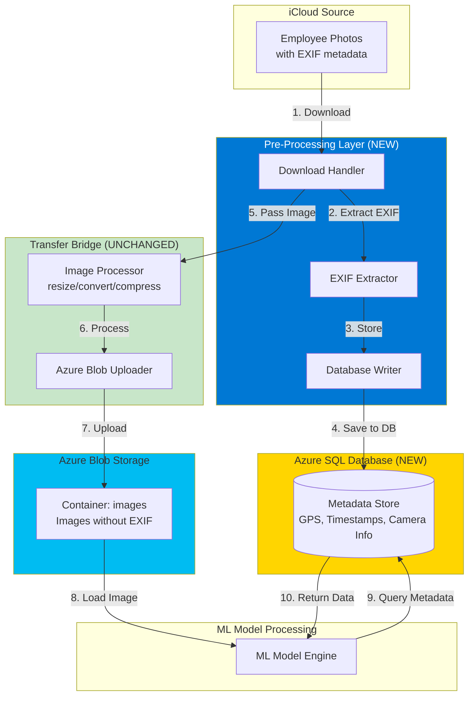
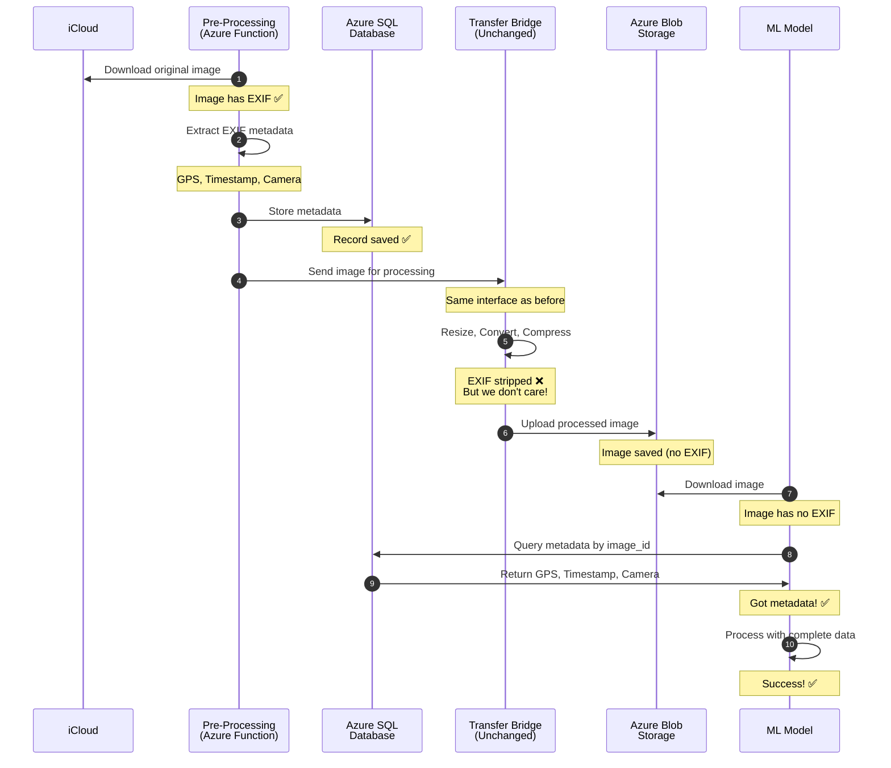

# Solution Architecture: EXIF Metadata Preservation (Azure)

**Problem**: Transfer Bridge strips EXIF metadata (GPS/Timestamps) during image processing  
**Solution**: Pre-Processing Metadata Store on Azure  
**Date**: February 27, 2026

---

## Architecture Overview

Extract and store EXIF metadata in Azure SQL Database **BEFORE** the Transfer Bridge processes images. This preserves the Bridge code unchanged while ensuring metadata is available for the ML model.

**Key Principle**: Save the metadata first, then let the Bridge do what it does.

---

## High-Level Architecture


---

## System Components

| Component | What It Does | Status |
|-----------|-------------|--------|
| **iCloud Source** | Original photos with EXIF | Existing |
| **Pre-Processing Layer** | Downloads, extracts EXIF, stores in database | **NEW** |
| **Azure SQL Database** | Stores metadata (GPS, timestamps, camera info) | **NEW** |
| **Transfer Bridge** | Resizes, compresses, uploads images | **UNCHANGED** |
| **Azure Blob Storage** | Stores processed images | Existing |
| **ML Model** | Processes images using metadata from database | Updated (queries DB) |

---

## Data Flow: Step-by-Step

### Visual Flow
```
┌─────────────────────────────────────────────────────────────┐
│ STEP 1: Original Photo in iCloud                            │
│                                                             │
│ employee_001.jpg                                            │
│ ├─ GPS: 37.7749, -122.4194                                 │
│ ├─ Timestamp: 2026-02-20 14:23:45                          │
│ └─ Camera: iPhone 13 Pro                                   │
└──────────────────────┬──────────────────────────────────────┘
                       │
                       ▼
┌─────────────────────────────────────────────────────────────┐
│ STEP 2: Pre-Processing Downloads & Extracts                 │
│                                                             │
│ Azure Function runs:                                        │
│ 1. Downloads image from iCloud                              │
│ 2. Opens image file                                         │
│ 3. Reads EXIF metadata                                      │
│ 4. Extracts key fields:                                     │
│    - GPS coordinates                                        │
│    - Timestamp                                              │
│    - Camera information                                     │
└──────────────────────┬──────────────────────────────────────┘
                       │
                       ▼
┌─────────────────────────────────────────────────────────────┐
│ STEP 3: Store in Azure SQL Database                         │
│                                                             │
│ Record created:                                             │
│ ┌─────────────────────────────────────────────────────┐   │
│ │ image_id: "employee_001.jpg"                        │   │
│ │ gps_latitude: 37.7749                               │   │
│ │ gps_longitude: -122.4194                            │   │
│ │ timestamp_original: 2026-02-20 14:23:45             │   │
│ │ camera_make: "Apple"                                │   │
│ │ camera_model: "iPhone 13 Pro"                       │   │
│ │ status: "OK"                                        │   │
│ └─────────────────────────────────────────────────────┘   │
│                                                             │
│ ✅ Metadata safely stored                                  │
└──────────────────────┬──────────────────────────────────────┘
                       │
                       ▼
┌─────────────────────────────────────────────────────────────┐
│ STEP 4: Pass to Transfer Bridge                             │
│                                                             │
│ Pre-Processing hands image file to Bridge                   │
│ - Bridge receives exactly what it expects                   │
│ - No changes to Bridge interface                            │
│ - Bridge doesn't know about pre-processing                  │
└──────────────────────┬──────────────────────────────────────┘
                       │
                       ▼
┌─────────────────────────────────────────────────────────────┐
│ STEP 5: Bridge Processes Image (UNCHANGED)                  │
│                                                             │
│ Bridge does its normal work:                                │
│ - Resizes image to 1920x1080                                │
│ - Converts to RGB                                           │
│ - Compresses to reduce file size                            │
│ - ❌ EXIF gets stripped during this process                 │
│                                                             │
│ But we don't care! We already saved it in Step 3!           │
└──────────────────────┬──────────────────────────────────────┘
                       │
                       ▼
┌─────────────────────────────────────────────────────────────┐
│ STEP 6: Upload to Azure Blob Storage                        │
│                                                             │
│ Bridge uploads processed image:                             │
│ - Container: images                                         │
│ - File: employee_001.jpg                                    │
│ - No EXIF metadata in the file                              │
│ - Upload completes successfully                             │
└──────────────────────┬──────────────────────────────────────┘
                       │
                       ▼
┌─────────────────────────────────────────────────────────────┐
│ STEP 7: ML Model Needs to Process                           │
│                                                             │
│ ML model workflow:                                          │
│ 1. Downloads image from Azure Blob Storage                  │
│ 2. Sees that image has no EXIF                              │
│ 3. Queries Azure SQL Database for metadata                  │
└──────────────────────┬──────────────────────────────────────┘
                       │
                       ▼
┌─────────────────────────────────────────────────────────────┐
│ STEP 8: Database Query                                      │
│                                                             │
│ Query: "Get metadata for employee_001.jpg"                  │
│                                                             │
│ Database returns:                                           │
│ ├─ GPS: 37.7749, -122.4194                                 │
│ ├─ Timestamp: 2026-02-20 14:23:45                          │
│ └─ Camera: iPhone 13 Pro                                   │
│                                                             │
│ Query time: ~20ms (fast!)                                   │
└──────────────────────┬──────────────────────────────────────┘
                       │
                       ▼
┌─────────────────────────────────────────────────────────────┐
│ STEP 9: ML Model Processes Successfully                     │
│                                                             │
│ ML model now has:                                           │
│ ✅ Image data (from Blob Storage)                           │
│ ✅ GPS coordinates (from Database)                          │
│ ✅ Timestamp (from Database)                                │
│                                                             │
│ Result: Processing succeeds!                                │
│ No more NULL errors!                                        │
└─────────────────────────────────────────────────────────────┘
```

---

## Sequence Diagram


---

## Database Schema (Simplified)

### What We Store
```
IMAGE_METADATA Table
┌─────────────────────────────────────────────────────┐
│ Field                  │ Example Value              │
├────────────────────────┼───────────────────────────┤
│ image_id               │ "employee_001.jpg"        │ (Primary Key)
│ gps_latitude           │ 37.7749                   │
│ gps_longitude          │ -122.4194                 │
│ gps_altitude           │ 52.3                      │
│ timestamp_original     │ 2026-02-20 14:23:45       │
│ camera_make            │ "Apple"                   │
│ camera_model           │ "iPhone 13 Pro"           │
│ image_width            │ 4032                      │
│ image_height           │ 3024                      │
│ status                 │ "OK"                      │
│ created_at             │ 2026-02-27 10:30:00       │
└─────────────────────────────────────────────────────┘
```

### Why This Structure?

- **Fast lookups**: Find metadata by image_id in milliseconds
- **Queryable**: Can ask questions like "Show me all images from warehouse cameras"
- **Scalable**: Handles millions of images
- **Audit trail**: Tracks when metadata was captured

---

## Key Design Decisions

### 1. Why Extract BEFORE Bridge?

**Problem**: Bridge strips EXIF during processing

**Solution**: Save EXIF before Bridge touches the image

**Analogy**: Like making a copy of important documents before sending originals through a shredder

### 2. Why Use Database Instead of Files?

| Approach | Database | JSON Files |
|----------|----------|------------|
| **Lookup Speed** | Very fast (indexed) | Slow (file system search) |
| **Queryable** | Yes (SQL queries) | No (must parse each file) |
| **Scalable** | Millions of records | Gets messy at scale |
| **Consistency** | Built-in (transactions) | Manual file management |
| **Cost** | $5-25/month | $0 but operational overhead |

**Decision**: Database is better for production systems

### 3. Why Azure Managed Identity?

**Old way** (passwords in code):
```
❌ Database password in configuration file
❌ Risk of password leaks
❌ Manual password rotation
```

**New way** (Managed Identity):
```
✅ Azure handles authentication automatically
✅ No passwords in code
✅ Automatic credential rotation
✅ More secure
```

---

## Azure Services Used
```
┌──────────────────────────────────────────────────┐
│  Resource Group: rg-zerocorp-image-pipeline      │
│                                                  │
│  ┌────────────────────────┐                     │
│  │ Azure Functions        │  $10-20/month       │
│  │ (Pre-Processing)       │                     │
│  └────────────────────────┘                     │
│                                                  │
│  ┌────────────────────────┐                     │
│  │ Azure SQL Database     │  $5/month           │
│  │ (Metadata Store)       │                     │
│  └────────────────────────┘                     │
│                                                  │
│  ┌────────────────────────┐                     │
│  │ Azure Blob Storage     │  Existing           │
│  │ (Images)               │                     │
│  └────────────────────────┘                     │
│                                                  │
│  ┌────────────────────────┐                     │
│  │ Application Insights   │  $10-20/month       │
│  │ (Monitoring)           │                     │
│  └────────────────────────┘                     │
│                                                  │
│  Total: $25-45/month                             │
└──────────────────────────────────────────────────┘
```

---

## Error Handling

### What Happens If Things Fail?

| Failure Scenario | System Response |
|-----------------|-----------------|
| **Image download fails** | Retry 3 times, then alert |
| **No EXIF in image** | Store record with status "EXIF_MISSING", continue processing |
| **Database write fails** | Retry, don't forward to Bridge until saved |
| **Bridge fails** | Retry, metadata already safely stored |
| **Database unavailable** | ML model shows clear error, operations team alerted |

**Key Principle**: Fail gracefully, never lose data, always log what happened

---

## Monitoring Dashboard
```
┌─────────────────────────────────────────────────────┐
│  ZeroCorp Image Pipeline - Live Status              │
├─────────────────────────────────────────────────────┤
│                                                     │
│  📊 Today's Processing                              │
│  ├─ Images Processed: 1,247                        │
│  ├─ EXIF Extracted: 99.8%                          │
│  ├─ Metadata Saved: 100%                           │
│  └─ ML Success Rate: 94.2% ✅                      │
│                                                     │
│  ⚡ Performance                                     │
│  ├─ Pre-Processing Time: 340ms avg                │
│  ├─ Database Write Time: 18ms avg                 │
│  └─ Metadata Query Time: 23ms avg                 │
│                                                     │
│  🚨 Alerts                                          │
│  └─ No active alerts ✅                            │
└─────────────────────────────────────────────────────┘
```

---

## Implementation Timeline
```
Week 1: Setup
├─ Day 1-2: Create Azure resources
├─ Day 3-4: Configure database schema
└─ Day 5: Set up monitoring

Week 2: Development
├─ Day 1-2: Build EXIF extraction
├─ Day 3-4: Database integration
└─ Day 5: Testing with sample images

Week 3: Integration
├─ Day 1-2: Connect ML model to database
├─ Day 3-4: End-to-end testing
└─ Day 5: Performance validation

Week 4: Production
├─ Day 1-2: Deploy to production
├─ Day 3-4: Monitor and validate
└─ Day 5: Documentation and handoff
```

---

## Success Metrics

### Week 2
- [ ] Every image has metadata in database
- [ ] Database queries complete in < 50ms

### Week 3
- [ ] ML model success rate back to 94%
- [ ] Zero "NULL metadata" errors

### Week 4
- [ ] System runs 24/7 without issues
- [ ] Bridge operates exactly as before
- [ ] Complete audit trail available

---

## Why This Solution Works

### ✅ Political Win
- Transfer Bridge code completely unchanged
- $50k investment fully preserved
- Star Developer's work respected
- CEO sees "enhancement" not "fix"

### ✅ Technical Win
- Solves metadata loss problem
- Scalable to millions of images
- Fast queries (milliseconds)
- Industry-standard architecture

### ✅ Business Win
- Fixes project delays
- Restores ML model accuracy
- Low monthly cost ($25-45)
- Quick implementation (4 weeks)

---

**Architecture Status**: Ready for Implementation  
**Risk Level**: Low (no Bridge modifications)  
**Estimated Cost**: $25-45/month  
**Implementation Time**: 3-4 weeks

---

**Related Documents**:
- See `SOLUTION.md` for options comparison
- See `RCA.md` for problem diagnosis
