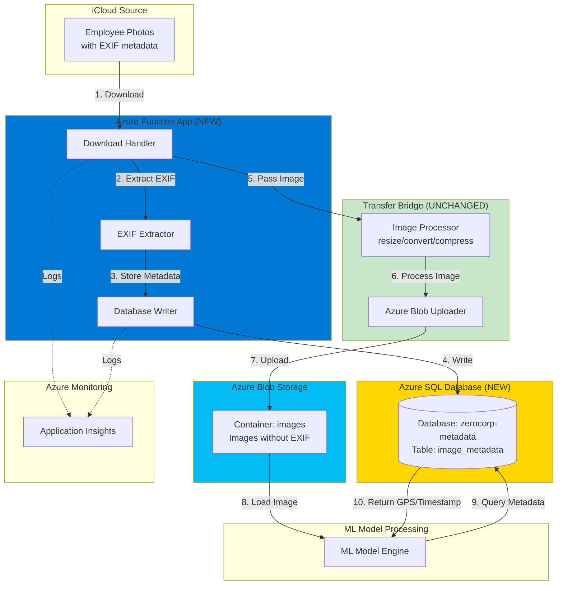

# Solution Architecture: EXIF Metadata Preservation (Azure)

**Problem**: Transfer Bridge strips EXIF metadata (GPS/Timestamps) during image processing  
**Solution**: Pre-Processing Metadata Store on Azure  
**Cloud Platform**: Microsoft Azure  
**Date**: February 27, 2026

---

## Architecture Overview

Extract and store EXIF metadata in Azure SQL Database BEFORE the Transfer Bridge processes images. This preserves the Bridge code unchanged while ensuring metadata is available for the ML model.

---

## High-Level Architecture Diagram


---

## Azure Components

| Azure Service | Purpose | Tier/Plan | Monthly Cost |
|--------------|---------|-----------|--------------|
| **Azure Functions** | EXIF extraction & processing | Consumption Plan | $10-20 |
| **Azure SQL Database** | Metadata storage | Basic (2GB) | $5 |
| **Azure Blob Storage** | Image storage | Hot tier | Existing |
| **Application Insights** | Monitoring & logging | Pay-as-you-go | $10-20 |
| **Total** | | | **$25-45/month** |

---

## Workflow

### Step 1: Image Upload to iCloud
```
Employee takes photo on iPhone
├─ Contains EXIF: GPS (37.7749, -122.4194)
├─ Contains EXIF: Timestamp (2026-02-20 14:23:45)
└─ Contains EXIF: Camera (iPhone 13 Pro)
```

### Step 2: Azure Function Triggers (Pre-Processing)
```
Azure Function: zerocorp-preprocessing
├─ Downloads image from iCloud
├─ Opens image with Pillow (Python)
├─ Extracts EXIF metadata
│  ├─ GPS coordinates
│  ├─ Timestamp
│  └─ Camera info
└─ Stores in Azure SQL Database
```

### Step 3: Store in Azure SQL Database
```sql
INSERT INTO image_metadata (
    image_id,
    gps_latitude,
    gps_longitude,
    timestamp_original,
    camera_make,
    camera_model
) VALUES (
    'employee_001.jpg',
    37.7749,
    -122.4194,
    '2026-02-20 14:23:45',
    'Apple',
    'iPhone 13 Pro'
)
```

### Step 4: Pass to Transfer Bridge (Unchanged)
```
Azure Function passes image file to Bridge
├─ Bridge receives same input as before
├─ Bridge resizes, converts, compresses
├─ Bridge strips EXIF (doesn't matter - already saved!)
└─ Bridge uploads to Azure Blob Storage
```

### Step 5: ML Model Processing
```
ML Model needs to process image
├─ Downloads image from Azure Blob Storage (no EXIF)
├─ Queries Azure SQL Database for metadata
│  └─ SELECT gps_latitude, gps_longitude, timestamp_original
│      FROM image_metadata WHERE image_id = 'employee_001.jpg'
├─ Receives: GPS (37.7749, -122.4194), Timestamp
└─ Processes successfully with complete metadata ✅
```

---

## Database Schema (Simplified)
```
TABLE: image_metadata
├─ image_id (Primary Key)           "employee_001.jpg"
├─ gps_latitude                     37.7749
├─ gps_longitude                    -122.4194
├─ timestamp_original               2026-02-20 14:23:45
├─ camera_make                      "Apple"
├─ camera_model                     "iPhone 13 Pro"
└─ created_at                       2026-02-27 10:30:00
```

---

## Key Benefits

### 1. No Bridge Modifications
```
Before:
iCloud → Bridge (strips EXIF) → CloudFactory → ML Model ❌ Fails

After:
iCloud → Pre-Processing (saves EXIF) → Database
              ↓
         Bridge (unchanged) → CloudFactory → ML Model → Database ✅ Success
```

### 2. Azure Managed Identity (No Passwords)
```
Azure Function → Azure SQL Database
└─ Authentication: Managed Identity (automatic, secure)
```

### 3. Built-in Monitoring
```
Application Insights automatically tracks:
├─ Function execution count
├─ Success/failure rates
├─ Query performance
└─ Errors and exceptions
```

---

## Data Flow Summary
```
┌─────────────┐
│   iCloud    │  EXIF ✅
└──────┬──────┘
       │
       ▼
┌─────────────┐
│   Azure     │  Extract EXIF
│  Function   │  Store in SQL ✅
└──────┬──────┘
       │
       ▼
┌─────────────┐
│  Transfer   │  Process Image
│   Bridge    │  EXIF stripped ❌ (but we don't care!)
└──────┬──────┘
       │
       ▼
┌─────────────┐
│   Azure     │  Image stored
│ Blob Storage│  No EXIF
└──────┬──────┘
       │
       ▼
┌─────────────┐
│  ML Model   │  Query SQL for EXIF ✅
│ Processing  │  Process successfully ✅
└─────────────┘
```

---

## Security (Azure)

**Authentication**:
- Azure Managed Identity (no passwords in code)
- Azure AD authentication for SQL Database

**Encryption**:
- Data at rest: AES-256 (automatic)
- Data in transit: TLS 1.2+ (enforced)

**Access Control**:
- Function App: Read/Write to SQL
- ML Model: Read-Only from SQL
- Firewall rules restrict database access

---

## Monitoring

**Application Insights Dashboard**:
```
┌─────────────────────────────────────┐
│  Image Processing Metrics           │
├─────────────────────────────────────┤
│  Function Executions: 1,247         │
│  Success Rate: 99.8%                │
│  Avg Duration: 342ms                │
│  SQL Query Latency: 23ms            │
│  EXIF Extraction Success: 99.5%     │
└─────────────────────────────────────┘
```

**Alerts**:
- Critical: Function failures > 5%
- Warning: SQL query latency > 100ms
- Info: EXIF extraction failures

---

## Implementation Timeline

| Week | Milestone | Deliverables |
|------|-----------|--------------|
| **Week 1** | Azure Setup | - Azure SQL Database created<br/>- Function App deployed<br/>- Schema configured |
| **Week 2** | Development | - EXIF extraction working<br/>- Database integration complete<br/>- Local testing passed |
| **Week 3** | Integration | - ML model connected to SQL<br/>- End-to-end testing<br/>- Performance validated |
| **Week 4** | Production | - Deployed to production<br/>- Monitoring active<br/>- Documentation complete |

---

## Cost Summary

**Monthly Operational Cost**: $25-45

**Breakdown**:
- Azure Functions: $10-20 (pay per execution)
- Azure SQL Database: $5 (Basic tier)
- Application Insights: $10-20 (logging)
- Blob Storage: Existing (no additional cost)

**One-Time Development**: 80-100 hours

---

## Success Criteria

**Week 2**:
- [ ] EXIF stored for 100% of images in Azure SQL
- [ ] Database query latency < 50ms

**Week 3**:
- [ ] ML model success rate returns to 94%
- [ ] Zero NULL metadata errors

**Week 4**:
- [ ] 99.9% uptime in production
- [ ] Zero Bridge functionality impacted
- [ ] Complete audit trail in Application Insights

---

**Architecture Status**: Approved for Implementation  
**Cloud Platform**: Microsoft Azure  
**Risk Level**: Low (no Bridge changes)  
**Political Impact**: Positive (preserves $50k investment)

**See SOLUTION.md for business justification and alternatives considered.**
